# Deathnote-1-Vulnhub-Walkthrough

> **Machine:** [Deathnote:1 (VulnHub)](https://www.vulnhub.com/entry/deathnote-1,739/)
> **Author:** HWKDS
> **Difficulty:** easy
> **Tested on:** Linux - 27/09/2025

---


Completed the **Deathnote:1** vulnerable machine. In this machine, our target is to find the flags and access the root. So, let’s get started.


---

## Table of contents

1. Environment
2. Summary of steps
3. Detailed walkthrough

   * 3.1 Scanning
   * 3.2 Enumeration
   * 3.3 Exploitation & Privilege escalation
4. Screenshots (findings)
5. Proof of access
6. Appendix: commands & tools
7. Responsible disclosure

---

## 1) Environment

* VM: VirtualBox
* Attacker OS: Kali Linux
* Target IP used in this writeup: 192.168.29.46
* Tools used: `netdiscover`, `nmap`, `dirb`, `hydra`.

---

## 2) Summary of steps

1. Execute netdiscover command to identify the host ip.
2. Full TCP port scan with `nmap` to identify services.
3. Found web server hosted on port 80.
4. Performed directory bruteforcing.
5. Found users and passwords text files
6. Bruteforced SSH.
7. Local enumeration (`sudo -l`, SUID/cron checks, file permissions) revealed a privilege escalation path to root.

---

## 3) Detailed walkthrough

### 3.1 Initial enumeration

A short ARP discovery confirmed the target host on the local network.

> See screenshot: 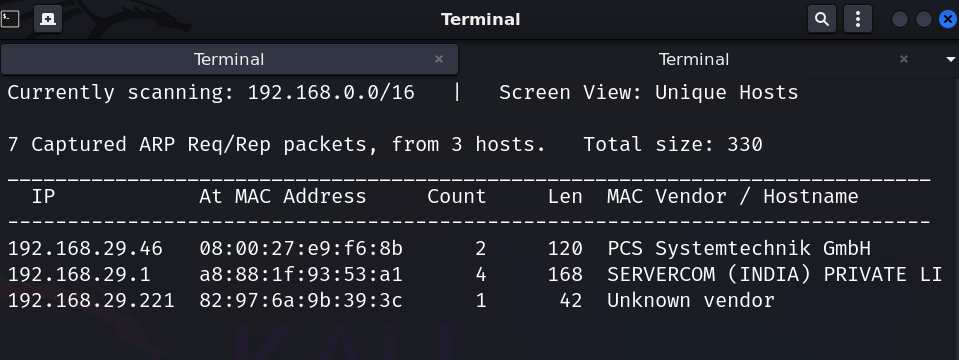 (ARP scan output).

**Port scan (command used):**

```bash
nmap -A 192.168.29.46
```

Important open services observed from the scan:

* `22/tcp` — SSH (OpenSSH 7.9p1)
* `80/tcp` — http (Apache httpd 2.4.38)

> See screenshot: 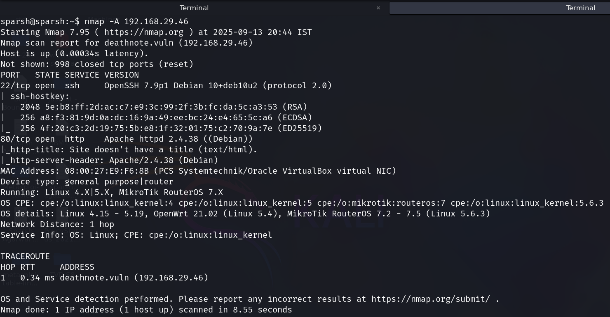 (nmap output showing SSH/http).

### 3.2 Found WordPress uploads folder via directory brute force:

> See screenshot: 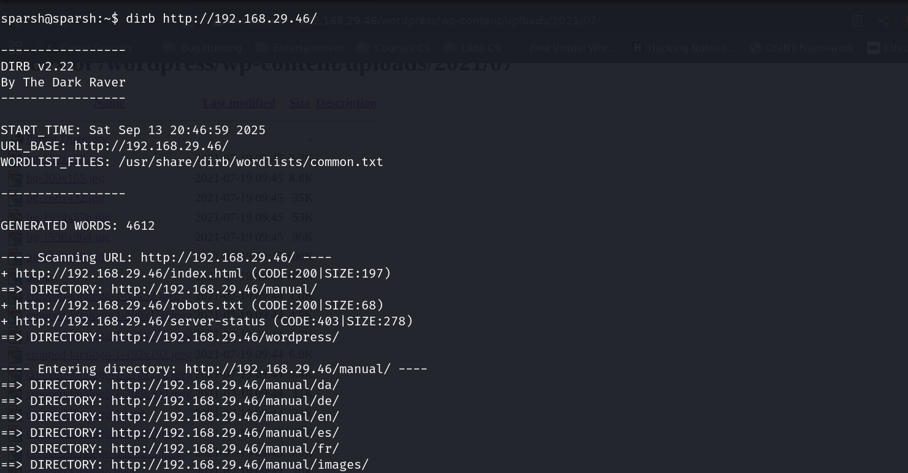 (dirb bruteforce).
> See screenshot: 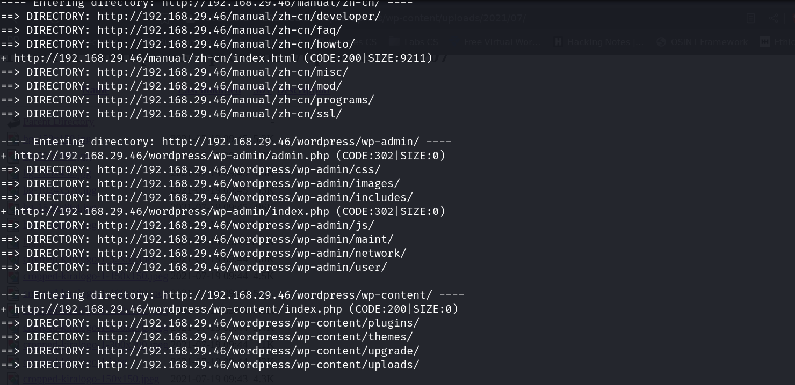 (found directory wp-content/uploads).
> See screenshot: 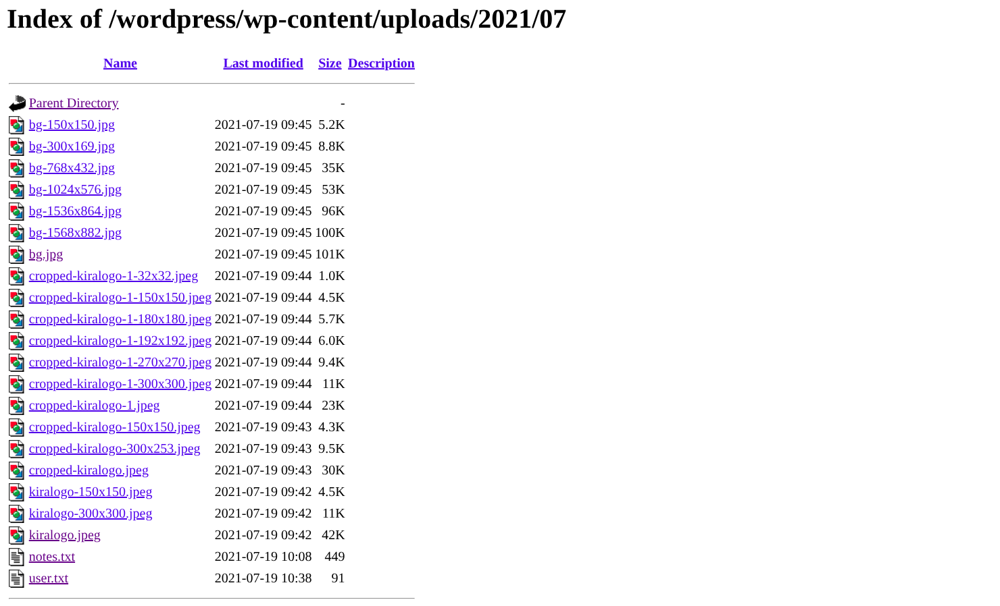 (found users.txt and notes.txt inside wp-content/uploads/2021/07).
> See screenshot: 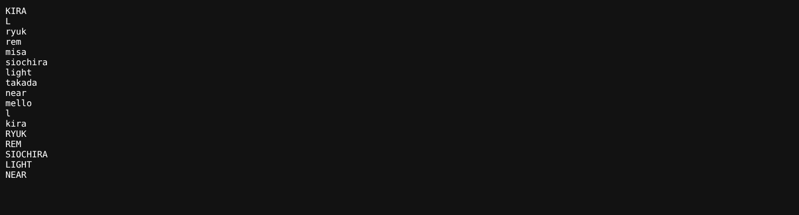 (users.txt).
> See screenshot: 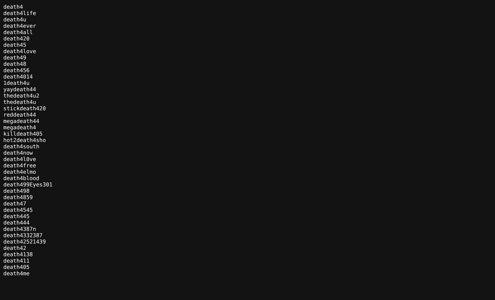 (notes.txt).

### 3.3 Used Hydra to brute force ssh service:

> See screenshot: 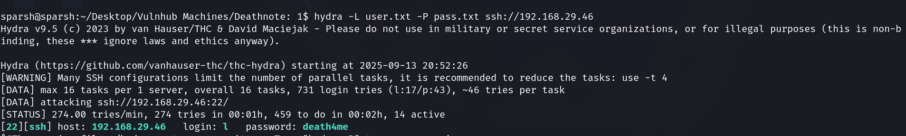 (hydra output).

### 3.4 Logged in with the credentials and found a wav file:

> See screenshot: 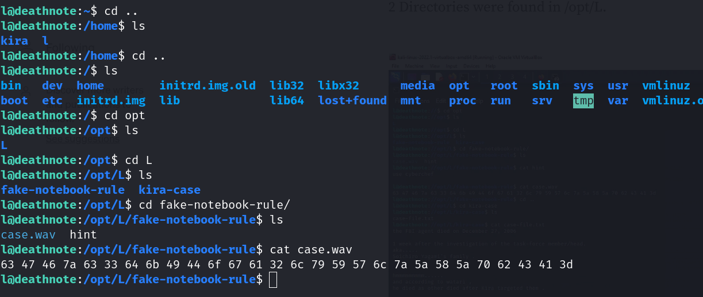 (wav file output).

### 3.4 Decoded the output using CyberChef:

> See screenshot: 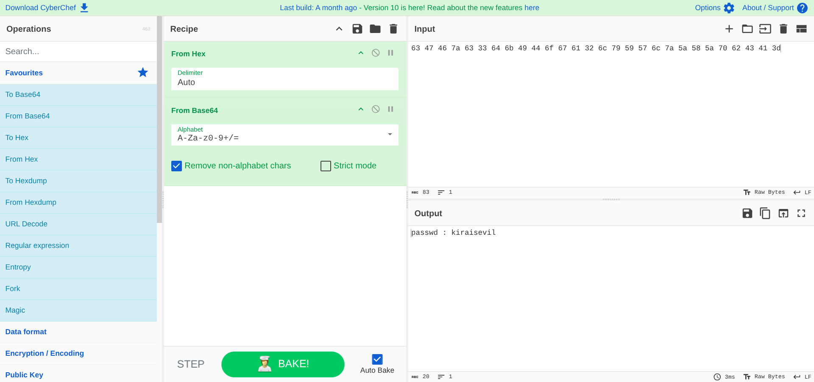 (cyberchef output).

### 3.4 Logged in as kira:

> See screenshot: 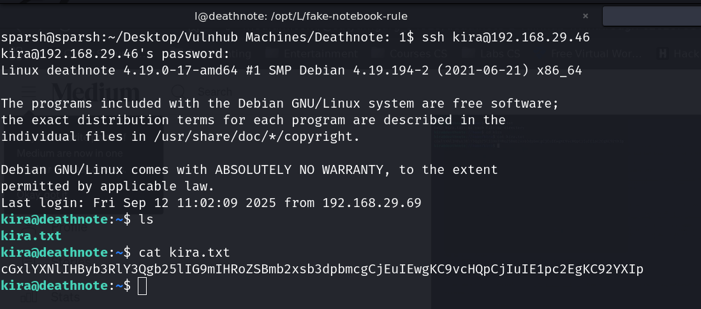 (kira.txt).

### 3.4 Escalated Priveleges:

> See screenshot: 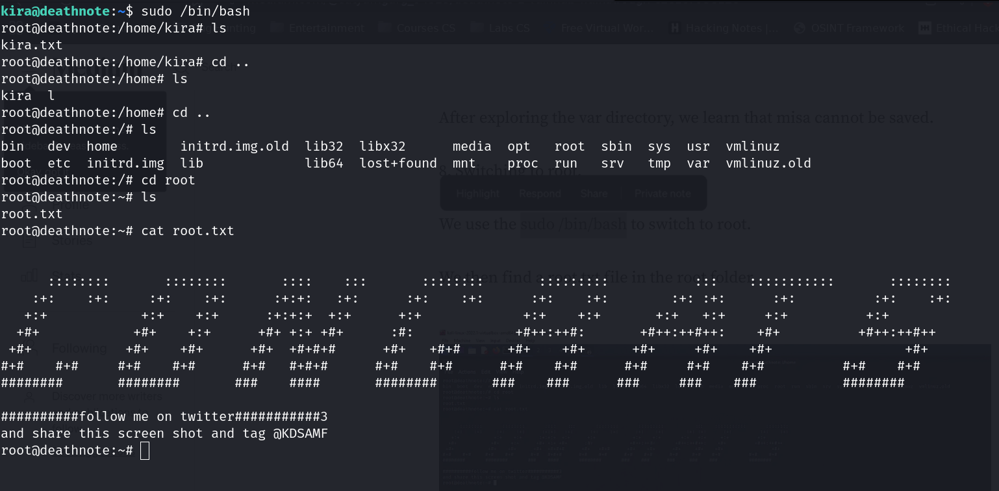 (root.txt).

## Responsible disclosure

This walkthrough is for educational purposes. Do not use these techniques on systems you do not own or have explicit permission to test. If you believe you have discovered a vulnerability on a real service, follow responsible disclosure procedures with the service owner.
